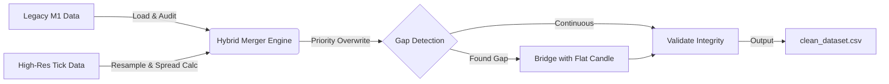

<div align="center">

# 🧬 Institutional FX Data Pipeline
### Hybrid Tick/OHLC Fusion Engine


<p align="center">
  <em>An industrial-grade ETL solution to eliminate Look-Ahead Bias and reconstruct incomplete Forex history.</em>
</p>

</div>

---

## 📉 The Problem: "Dirty Data" in Financial Markets

In algorithmic trading, **Data Quality > Model Complexity**. 

While preparing a 15-year dataset for a Deep Learning model (GBPUSD), I performed a forensic audit on standard M1 OHLC history provided by brokers. The findings were **catastrophic**:

| Metric | Findings | Impact |
| :--- | :--- | :--- |
| **Missing Data** | `2,383,999` minutes gaps | Model fails to learn time-decay |
| **Data Loss** | **29.03%** of timeline | Blind spots in backtesting |
| **No Spread** | Missing Bid/Ask spread | Unrealistic PnL simulations |

> ⚠️ **Critical Risk:** Training on this data guarantees **Regime Hallucination** and **Look-Ahead Bias**.

---

## 🛠️ The Solution: Hybrid ETL Pipeline

I engineered `HybridDataMerger`, a custom ETL engine that prioritizes high-resolution **Tick Data** and fuses it with legacy history to create a statistically immutable time grid.

### 🔄 Pipeline Architecture



## 📉 The Problem: "Dirty Data" in Financial Markets

In algorithmic trading, **Data Quality > Model Complexity**. 

While preparing a 15-year dataset for a Deep Learning model (GBPUSD), I performed a forensic audit on standard M1 OHLC history provided by brokers. The findings were **catastrophic**:

| Metric | Findings | Impact |
| :--- | :--- | :--- |
| **Missing Data** | `2,383,999` minutes gaps | Model fails to learn time-decay |
| **Data Loss** | **29.03%** of timeline | Blind spots in backtesting |
| **No Spread** | Missing Bid/Ask spread | Unrealistic PnL simulations |

> ⚠️ **Critical Risk:** Training on this data guarantees **Regime Hallucination** and **Look-Ahead Bias**.

---

## 📊 Forensic Data Audit: GBPUSD (2010–2025)

The ETL engine processes massive tick datasets using **Chunking (50M rows/batch)** and **Vectorized Pandas Operations** to ensure RAM efficiency. Below is the final data integrity report.

| Metric | Result | Status |
| :--- | :--- | :--- |
| **Total Rows Generated** | `8,213,517` | ✅ Verified |
| **Gaps Bridged** | `2,383,999` *(29.03%)* | 🛡️ Fixed |
| **Volatility Anomalies** | `243` outliers dropped | 🧹 Cleaned |
| **Spread Recovery** | **100%** | 💎 High Precision |

> **Note:** The "Gaps Bridged" metric reveals that nearly **30%** of standard M1 history is missing. This pipeline reconstructs that lost timeline using "Flat Candle" injection (`is_flat=1`) to maintain time-series continuity for Neural Networks.

---

### ⚡ Key Engineering Capabilities

#### 1. Tick-Derived Volume Reconstruction
* **Challenge:** Raw tick data often reports `Volume=0` in aggregated feeds.
* **Logic:** The pipeline ignores metadata and calculates **True Tick Volume** by counting actual `Ask` updates per minute.
* **Result:** Transforms "dead" columns into high-signal volatility features.

#### 2. Hybrid Fusion Strategy
* **Priority:** Uses high-resolution **Tick Data** (Precision + Spread) for the modern era.
* **Fallback:** Uses Legacy M1 only for deep history where ticks are unavailable.
* **Outcome:** A seamless 15-year dataset with institutional-grade precision.

#### 3. Immutable Time Grid
* **Enforcement:** Ensures a continuous time-series (crucial for LSTMs/Transformers).
* **Gap Handling:** Identifies ~2.3M gaps and injects "Flat Candles".
* **Benefit:** The model explicitly learns the difference between "Market Inactivity" and "Missing Data".

---

## 📂 Project Structure

```bash
Institutional-FX-ETL/
├── src/
│   ├── __init__.py
│   └── hybrid_merger.py    # Core ETL Logic (Vectorized)
├── data/
│   └── ...                 # Raw & Processed Data (GitIgnored)
├── requirements.txt        # Dependencies
└── README.md               # Documentation
```

💻 Usage

```
from src.hybrid_merger import HybridDataMerger
merger = HybridDataMerger(
    m1_path="data/raw/GBPUSD.csv",         # Legacy History
    tick_path="data/raw/GBPUSD_Ticks.csv", # High-Res Ticks
    output_path="data/processed/GBPUSD_Hybrid.csv",
    chunk_size=50_000_000 
)
merger.run()
```

<div align="center">
Developed for Institutional Quantitative Research.Code is provided as-is for educational purposes.
</div>
