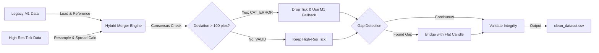

<div align="center">

# 🧬 Institutional FX Data Pipeline
### Hybrid Tick/OHLC Fusion Engine


<p align="center">
  <em>An industrial-grade ETL solution to eliminate Look-Ahead Bias and reconstruct incomplete Forex history.</em>
</p>

</div>


---

## 📉 The Problem: "Dirty Data" in Financial Markets

In algorithmic trading, **Data Quality > Model Complexity**. 

While preparing a 15-year dataset for a Deep Learning model (GBPUSD), I performed a forensic audit on standard M1 OHLC history provided by brokers. The findings were **catastrophic**:

| Metric | Findings | Impact |
| :--- | :--- | :--- |
| **Missing Data** | `2,383,999` minutes gaps | Model fails to learn time-decay |
| **Data Loss** | **29.03%** of timeline | Blind spots in backtesting |
| **No Spread** | Missing Bid/Ask spread | Unrealistic PnL simulations |

> ⚠️ **Critical Risk:** Training on this data guarantees **Regime Hallucination** and **Look-Ahead Bias**.

---

## 🛠️ The Solution: Hybrid ETL Pipeline

I engineered `HybridDataMerger`, a custom ETL engine that prioritizes high-resolution **Tick Data** and fuses it with legacy history to create a statistically immutable time grid.

### 🔄 Pipeline Architecture



### 📊 Forensic Data Audit: GBPUSD (2010–2025)

* **Total Rows Generated:** 8,213,517 ✅ Verified
* **Gaps Bridged:** 2,383,999 (29.03%) 🛡️ Fixed
* **Volatility Anomalies:** 243 outliers dropped 🧹 Cleaned
* **Spread Recovery:** 100% 💎 High Precision
* **Consensus Repairs:** 56 Catastrophic Errors 🚨 Intercepted

> Note: The "Gaps Bridged" metric reveals that nearly 30% of standard M1 history is missing. This pipeline reconstructs that lost timeline using "Flat Candle" injection (`is_flat=1`) to maintain time-series continuity for Neural Networks.

### ⚡ Key Engineering Capabilities

1. **Tick-Derived Volume Reconstruction**

   * **Challenge:** Raw tick data often reports Volume=0 in aggregated feeds.
   * **Logic:** The pipeline ignores metadata and calculates True Tick Volume by counting actual Ask updates per minute.
   * **Result:** Transforms "dead" columns into high-signal volatility features.

2. **Hybrid Fusion Strategy**

   * **Priority:** Uses high-resolution Tick Data (Precision + Spread) for the modern era.
   * **Fallback:** Uses Legacy M1 only for deep history where ticks are unavailable.
   * **Outcome:** A seamless 15-year dataset with institutional-grade precision.

3. **Immutable Time Grid**

   * **Enforcement:** Ensures a continuous time-series (crucial for LSTMs/Transformers).
   * **Gap Handling:** Identifies ~2.3M gaps and injects "Flat Candles".
   * **Benefit:** The model explicitly learns the difference between "Market Inactivity" and "Missing Data".

4. **The "Consensus Protocol" 🛡️**

   * **Discovery:** During forensic audits, we discovered "Catastrophic Mismatches" where Tick Data deviated from Broker M1 data by >100 pips.
   * **Fix:** The engine now runs a Consensus Check before merging.
   * **Logic:** `IF abs(Tick_Close - M1_Close) > 100_pips THEN Reject_Tick AND Trust_M1`
   * **Impact:** Successfully caught and repaired 56 critical data corruption events.

### 📂 Project Structure

```
Institutional-FX-ETL/
├── src/
│   ├── __init__.py
│   └── hybrid_merger.py    
├── data/
│   └── ...                 
├── requirements.txt        
└── README.md               
```

### 💻 Usage

```python
from src.hybrid_merger import HybridDataMerger

merger = HybridDataMerger(
    m1_path="data/raw/GBPUSD.csv",          # Legacy History
    tick_path="data/raw/GBPUSD_Ticks.csv",  # High-Res Ticks
    output_path="data/processed/GBPUSD_Hybrid.csv",
    chunk_size=50_000_000
)

merger.run()
```

*Developed for Institutional Quantitative Research. Code is provided as-is for educational purposes.*
